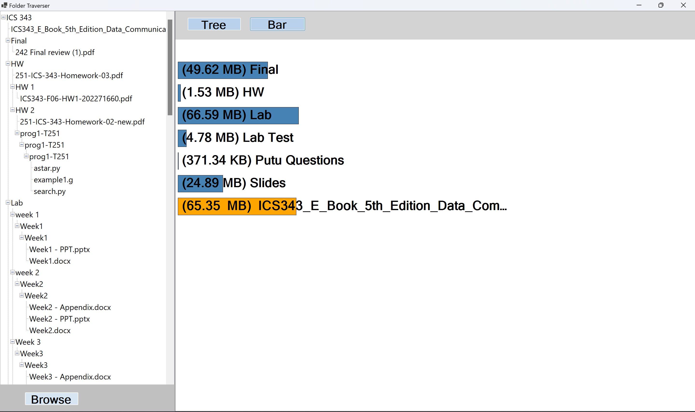

# file-system-visualizer

C# desktop application that visualizes file system directories using tree and bar chart views.

## Features
- Visualize folder hierarchy using Tree view
- Compare folder sizes using Bar chart
- Built using C# and Windows Forms
- Uses the Composite Design Pattern

## Screenshots

### Tree View

### Bar Chart

